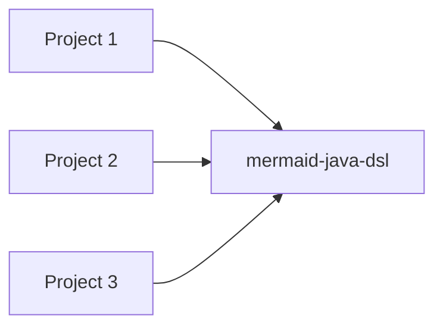

One of the things I'm notoriously bad at is visualising. Some people have vivid pictures in their minds; I'm met with a dark void.

That's probably why I'm so reliant on documentation to organise my thoughts: I need the visual support. 

But, like most technically inclined people, I'm also (selectively!) extremely lazy.  Maintaining documentation by hand is time-consuming, unsatisfactory and, most of the time, a lost battle. 

 So quite naturally, I developed an interest in living documentation. After all, it's time spent doing what I like - playing with code - to obtain what I need: an easy-to-consume representation of knowledge that would otherwise remain scattered throughout the project. 

I find the emergence of  knowledge from raw data extremely satisfying. 

In need of visual representations, I've looked at different options for diagram generation and eventually settled on Mermaid.
It supports most of the diagram types I need, lets me focus on content instead of layout and is widely supported (Confluence, GitHub, GitLab, even this Jekyll site...).

It is also remarkably easy to generate. All you need is a StringBuilder and you are good to go. 

That StringBuilder... Having to go back to the Mermaid documentation every time I needed to check the syntax for a diagram was a no-go for me. 

I was in Java; I wanted a Java DSL. I prefer working with an abstraction that lets my IDE help me with completion and is less error-prone than handling raw strings everywhere.  

Surprisingly, and really frustratingly, I couldn't find one. Be it because living documentation isn't widespread or because I'm lazier than most, apparently the DIY approach was the way to go. 

So that's what I did. I wrapped it in a thin DSL. Then I copied it, then I copied it, then... you get the idea.

Eventually, when I got fed up with the duplication, I extracted it into a small reusable library. At first, just for myself.

I intentionally kept the DSL close to Mermaid's terminology. The goal wasn't to invent another abstraction, only to avoid writing Mermaid by hand.

```java
new FlowchartDiagram()
	.direction(LR)
    .addNode(node("P1").shape(classicNodeShape("Project 1", SQUARE_EDGES)))
    .addNode(node("P2").shape(classicNodeShape("Project 2", SQUARE_EDGES)))
    .addNode(node("P3").shape(classicNodeShape("Project 3", SQUARE_EDGES)))
    .addNode(node("DSL").shape(classicNodeShape("mermaid-java-dsl", SQUARE_EDGES)))
    
    .addLink("P1", "DSL")
    .addLink("P2", "DSL")
    .addLink("P3", "DSL");
```



But selective laziness struck again, this time in the opposite direction: Reusable code needs to be tested.
So I turned the examples from the Mermaid documentation into tests. If the DSL could reproduce the documented diagrams, I could be reasonably confident it generated valid Mermaid. And of course, I had to cover *all* the examples... because.

That could have been the end of the story. My problem was solved,  and the little library had been living its best life on my personal GitLab for quite a while. What a nice Happy Ending. 

But I remembered my own frustration when I was looking for something similar and couldn't find anything. So I figured I might as well open-source it.

It doesn't implement every Mermaid diagram type, only the ones I actively use (Flowcharts and Class Diagrams for now). That said, those implementations cover all the examples from the Mermaid documentation, so they should be fairly complete.

It solved my problem. 

If it happens to solve yours too, even better.

The code is on GitHub: https://github.com/lamzi-com/mermaid-java-dsl  and if you'd like to give it a try, it's available on Maven Central:

```xml 
<dependency>
    <groupId>com.lamzi.doc</groupId>
    <artifactId>mermaid-java-dsl</artifactId>
</dependency>
```

It's still undocumented, but the test cases are full of examples.

* [classDiagram](https://github.com/lamzi-com/mermaid-java-dsl/blob/main/src/test/java/com/lamzi/doc/mermaid/diagram/classdiagram/ClassDiagramTest.java)

* [flowchartDiagram](https://github.com/lamzi-com/mermaid-java-dsl/blob/main/src/test/java/com/lamzi/doc/mermaid/diagram/flowchart/FlowchartDiagramTest.java)

