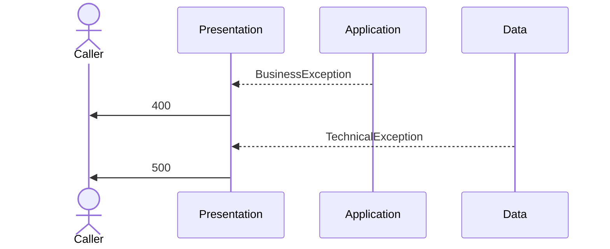
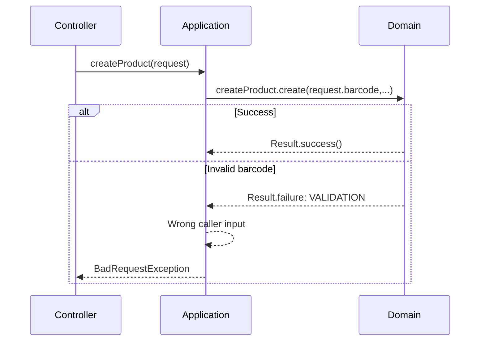
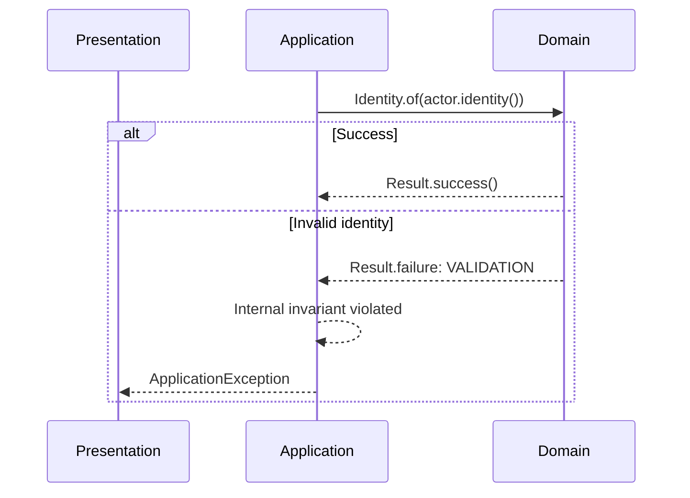

Most of the applications I've been working on are fairly typical three-tier application. In those, each layer throws exceptions, they are either caught and converted by the next layer or - most of the time - are just runtime exceptions converted into HTTP response by an exception handler at presentation level:

 




When needed, some projects added an Error code as an enum in order to perform more complex handling. For most applications, it's more than enough. 

I'm currently working on an application with a richer business and decided to formalise it into an additional **domain** layer. 

This ended up being a  DDD inspired application with an hexagonal architecture: 


The typical runtime exceptions handled by the presentation layer still worked well for interrupting the flow in the application and infrastructure layers, but they felt less appropriate at the boundary with the new domain layer. That made me wonder whether expected business failures should really follow the same pattern.

## Requirements

Going back to the drawing board for something as fundamental as failure handling is an interesting exercise. It's not something I'd ever really questioned before.

I had already worked on modelling exceptions so they could carry additional information useful to the front-end, but the underlying pattern was still the same: something fails, an exception interrupts the flow, and the presentation layer eventually turns it into a response.

This time felt different. A responsibility that traditionally belongs to a single layer in a three-tier application was now split across two.  And neither had the full picture: the domain knew *what* failed, while its caller knew *in which context* that failure occurred.

> The domain should report what failed, but not decide what that failure means

The domain cannot know if a failure is a critical exception or a simple business rejection. those are the consequences of the failure, they are not the failure itself. As an example, failing to build a Category in an application service is most likely due to an invalid input that needs to be reported back to the user while the same failure from the infrastructure layer means data corruption. the domain doesn't know. 

Since the service handling the domain should be able to handle failures appropriately, it needs to be clearly apparent in the contract 

> The caller must be aware that the operation it performed might result in failure  

And more generally, failures as much as success should be part of the normal domain behaviour. 

> Any operation impacting the domain should result either in a success or a failure. 

Expected business failures are part of the normal behaviour of the domain, not exceptional situations.

An additional property that I  wanted to have is to allow  for multiple business failures to be reported for a single operation. 

> The model must be able to represent all meaningful business failures produced by an operation.

Some domain operations may fail for more than one reason. The model should not force you to pick only one violation if several are meaningful.

## Representation

So what should we use as the carrier for those failures? 

The obvious first contender was using exceptions.  It's familiar and it works.  I'm not for reinventing the wheel just for the sake of it. 

**Runtime exceptions** were not an option as they are not visible in the contract.  **Checked exceptions** on the other hand checked (pun intended) nearly all the boxes. Representing multiple failures feels a bit awkward but aside from that, it does the job. 

It is worth asking though:  are business failures really exceptional and if not, should they be treated as exceptions?

Another contender, one that I like a lot, is to explicitly model domain operations as returning a **Result**.  

It aligns well with the idea that  *Any operation impacting the domain should result either in a success or a failure.* and it explicitly tells the caller that the operation may fail by making failure part of the return contract. It also supports all of  my requirements.

The only downside I found is that we don't have control over the return type of a constructor. It's not a major drawback though, it's easy to turn the constructors private and hide them behind a factory method. 

 Both can do the job, but each comes with trade-offs.

One advantage checked exceptions have is that the compiler forces the caller to acknowledge them. A `Result` can simply be ignored. 
In practice I found that discipline, reviews and static analysis were enough, but it's a trade-off worth acknowledging.

On the other side, catching an exception only to convert it into another one is heavy.  It sure works, but it made me wonder: am I modelling the failure, or merely re-purposing exceptions to represent ordinary business outcomes?

If a business operation can normally end in either success or rejection, `Result` represents that reality better than an exception.

Overall, I went with the `Result` approach because I felt it aligned better with the spirit of my requirements but checked exceptions  would have been a perfectly valid solution as well. 

All things considered, the right responsibility split is much more important than the mechanism used to implement it.  

## Interpretation

Similarly to the domain not being able to select the right presentation-facing exception by itself, the application cannot infer it from the context alone. 

Consider a  `productCreator.create` operation : 

```java 
productCreator.create(name, barcode, actor)
```

 it could fail because the product barcode is invalid, because the actor isn't authorised to create a product, or because the barcode is already in use. Although they are all business failures, they lead to different outcomes: BadRequest, Forbidden or Conflict. 

The application service must be able to determine the appropriate action based on both the context and the failure it received.  

One option is to base the application's decision on individual business failures. This provides the maximum amount of semantic information, but it also tightly couples the application to the domain's business rules.

Another option is to expose a broader classification of business failures instead of the individual failures themselves. This can be achieved by introducing **failure categories** that group together business failures sharing the same broad semantics.

Most of the time, the application doesn't need to know whether the barcode or the product name is invalid, only that it is dealing with a `VALIDATION` failure. Broadly speaking, it only needs to know **what kind of failure** it received in order to make an informed decision, not the specific business rule that was violated.

And what if the application needs to react to a specific business failure? Working with typed failures still allows it to base its decision on more detailed information when, and only when,  it needs it. 

The two approaches can be summarised as follows: 

| Individual failures               | Failure categories                        |
| --------------------------------- | ----------------------------------------- |
| Explain exactly **what** failed   | Explain **what kind** of failure occurred |
| Large and grows with the business | Small and relatively stable               |
| Fine-grained                      | Coarse-grained                            |
| Used when detail matters          | Used when broad semantics are enough      |

The application's decision space is intentionally much smaller than the domain's failure space: the domain should be free to grow new business rules without forcing the application to grow new decision logic.

Individual failures explain **what** happened; categories provide just enough information for the application to decide **what to do**.

But that alone is is not enough to determine the application's response. The same business failure may have different meanings depending on **how the situation arose** and **who is responsible for it**..

During product creation, a `VALIDATION` failure is interpreted as a `BadRequest` because the invalid data originates from the caller.




By contrast, when validating an identity that was produced internally, the same `VALIDATION` failure indicates an application invariant has been violated and therefore results in an `ApplicationException`



Armed with both the context and the kind of failure it received, the application has all the information it needs to interpret the failure correctly.

## Conclusion 

I think I ended up in a comfortable place.  The responsibility split between the different layers is coherent 

* **presentation** produce caller facing HTTP Responses 
* **application** determine what kind of exception to throw based on the orchestration context and the type of failures it encountered
* **domain** enforces business rules and inform on failures
* **infrastructure**  throws only technical exceptions

The domain knows why something is invalid. The application knows whether that invalidity is expected but it needed  *some* semantic information to make a decision. Introducing the failure categories neatly solved the tension between the application having to know too much (being aware of every expected failures in the context) or too little ( just getting a failure without knowing how to interpret it). 

The value of categories is not only that they reduce coupling. It is that they let the application handle an **exhaustive closed set of interpretations** without knowing the **open-ended set of business failures**.

Regarding the failure carrier, once you've ruled out the objectively poor fit of run time exceptions, I don't think the choice has much importance. At this point,  the team's experience and conventions become a perfectly valid tie-breaker. It's somewhat ironic that I ended up comparing two approaches that are both less common today. Runtime exceptions have become the default in many Java applications, but they were the first option I ruled out because they didn't satisfy my main requirement: making expected business failures part of the contract.
